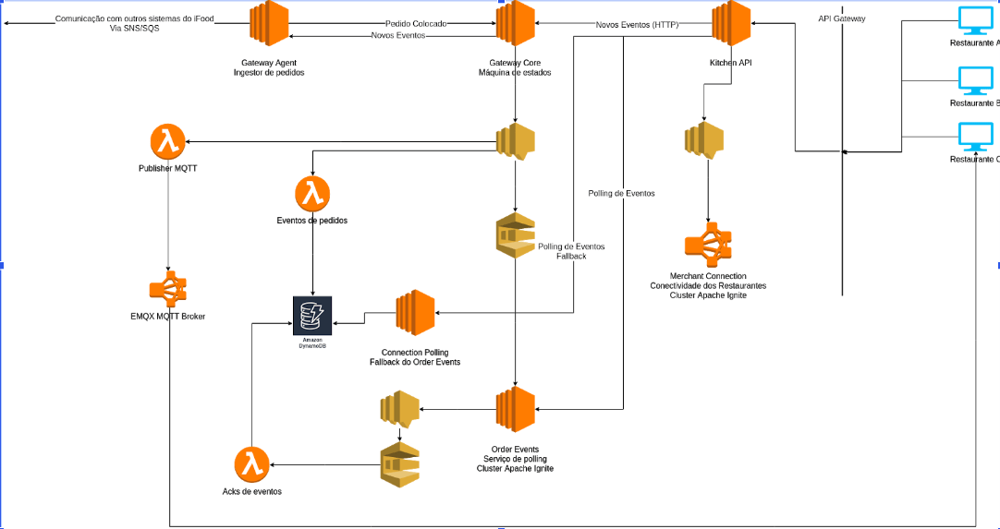

# Anotações da palestra Conectando +60k restaurantes: a saga arquitetural do iFood


## Sobre o Evento
O QCon São Paulo 2019 aconteceu de 06 a 08 de maio, celebrando 10 anos do evento no Brasil. Foram 99 palestras, com a presença de mais de 1.500 pessoas ao longo dos 3 dias de evento. Fique por dentro das novidades das próximas edições acessando o site e as redes sociais do QCon São Paulo!


## Link da palestra :
```
https://www.infoq.com/br/presentations/saga-arquitetural-do-ifood/ disponível em 06/03/2021
```

## Arquitetura exposta na palestra 



## Anotações 

## Gateway Agent : É o ponto de entrada do sistema.
```
1- Converte do formato externo para o formato interno <br>
2- Configs de serviços usados internamente <br>
3- Produz eventos em tópicos/filas separados 
```
## Gataway Core 
```
1- Polling de eventos de integrações legadas <br>
2- Controle de dispositivos de um restaurante <br>
3- Validação da transição do status do pedido.  Mapea se o status é viável
```
## Merchant Connection
```
1- Controla o status do restaurante. <br>
2- A cada 5 s roda um mapReduce para verificar se o restaurante esta online. <br>
```
## Apache Ignite 
```
Banco de dados em memória que permite sql em memória
```

## Order-Events
```
Indexa em memória os eventos validados pelo Core.
```

## Kitchen API - Dividido em 3 pontos  

### Kitchen polling 

```
Responde as rotas de polling
```

### Kitchen Conneciton

```
Responde as rotas críticas relacionadas ao pedido : detalhes,integração,confirmação,etc.
```

### Kitchen EndPoint 

```
Responde as rotas não-criticas relacionadas ao pedido: configurações,SKUs, etc..
```


